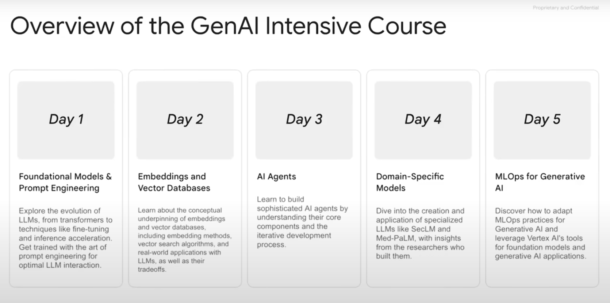
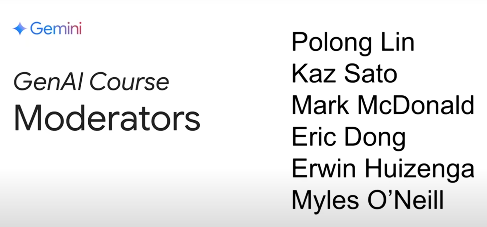
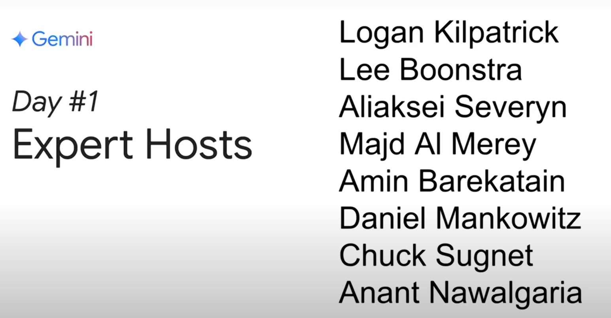

### 📚🎓🧠Resources

* [Day 1 Livestream with Paige Bailey – 5-Day Gen AI Intensive Course | Kaggle](https://www.youtube.com/watch?v=kpRyiJUUFxY&list=PLqFaTIg4myu-b1PlxitQdY0UYIbys-2es&index=2)
* [(217) Discord | #5dgai-q-and-a | Kaggle](https://discord.com/channels/1101210829807956100/1303438695143178251)
* [Kaggle GenAI, Nov 11, 2024 (Day 1): Tips &amp; Tricks - YouTube](https://www.youtube.com/watch?v=v5bhhJ9FD60&t=24s)
* [Gemini API  |  Google AI for Developers](https://ai.google.dev/gemini-api/docs)
* [Google AI Studio](https://aistudio.google.com/prompts/new_chat)
* [https://www.kaggle.com/code/aakash404/day-1-prompting/](https://www.kaggle.com/code/aakash404/day-1-prompting/)

---

### **⚙️ Setup Instructions**

* Sign up for a [Kaggle account](https://notifications.googleapis.com/email/redirect?t=AFG8qyUgOy4PEZdjz8xQEpDv5W1HfN9I953Pnm1U93hjjkG6aATHS-IgWuBr4pGy7nq3RqjQys9bWzbuw2-mvNrGP84Fxdg66zLFcxdgVZqRy9NdslJaqK2PIvfMnS5sOjueISH3kt7TLfvtwp7O0tjRdA1yGqyp-ruaqKUq3jic51MdQnes8X5xzJeZ0iydkhndWmcCI3H24sx1FEeBdBd5TiWuHysxP-K04p0T43qyBQfKnzGyQojIvpexd59gOEbQsC3t&r=eJzLKCkpKLbS1y8vL9fLTkxPz0nVS87P1QcAZ1kIZg&s=ALHZ2r6nD87O1ESSzJ9vOEUik5fA) and [learn how Notebooks work](https://notifications.googleapis.com/email/redirect?t=AFG8qyXK9FwaoFn-rIOtEZgHxHHa55HxVBaYyKPyMs4VuvWK3LAT9dirzk5_rBEochDXb_ENAHGT98mNgNbp0MM4Ctcw9U_d5SjeNurHJUlLQyMWi-RQuhHnOqgHD1vQ22G_TAHOEe32gdpVXu4JvEfvW8YUiqaATnhRAlWApJcnllUnJAvX3oKY5ghPiOG0XIubYlubjmQ-RzEt8hAR7vwMSzaz2DLdnODcXGclDdUxfyihc810VpKQCo7hmbd3YfAIiCOc&r=eJzLKCkpKLbS1y8vL9fLTkxPz0nVS87P1U_JTy7Wz8svSU3Kz88uBgAGng4S&s=ALHZ2r5tpjdIxcpldZLTwO3LOGFl). Make sure to [phone verify](https://notifications.googleapis.com/email/redirect?t=AFG8qyXu3bsNDChhT7GKfogCqZVWSEvpjeBAObJ6HUTC6PQ7oKxnJa4sin1XcqV3G8gMoccRQKpJ0l14lOv0s122xVWMkidhz4Z-Ua5tPtgKP_dL7J3iIzOcl25Ud25F91jLv1RPdI1fpXBvQM2GB8mC7u08elWmM9Gv-PdPU0PeCHhm-Rb2sszeeWsSHfSo7ezfaygo5YtpKautg9jNKLZqdMtmB-kJFNsCyIMxQbc_kEggXBPw7AkiulLZbJXTRhCXcNYG&r=eJzLKCkpKLbS1y8vL9fLTkxPz0nVS87P1S9OLSnJzEsvBgC6DwvX&s=ALHZ2r7wwm68KjP6KIKfvRebJr4l) your account, it’s necessary for the course’s code labs.
* Sign up for an  [AI Studio](https://aistudio.google.com/prompts/new_chat) account and ensure you can generate an [API key](https://aistudio.google.com/app/apikey).
* Sign up for a Discord account and join us on the [Kaggle Discord server](https://discord.com/invite/kaggle). We have 3 channels dedicated to this event:
  * [#5dgai-general-chat](https://discord.com/channels/1101210829807956100/1303438361117069363): find official course announcements and livestream recordings.
  * [#5dgai-introductions](https://discord.com/channels/1101210829807956100/1303438635772809311): introduce yourself and meet other participants from around the world.
  * [#5dgai-q-and-a](https://discord.com/channels/1101210829807956100/1303438695143178251): ask questions and kick off discussions about the assignments.
* Please note that if you would like to post on other channels on the Kaggle Discord you will need to link your Kaggle account to Discord here: [https://kaggle.com/discord/confirmation](https://notifications.googleapis.com/email/redirect?t=AFG8qyVHuM_-pwYCadOIbSSb5IwK86MiD5OW62EFLXpmNUMZhzBlNzUQERqVYcR-0d1FJRtlvT7RdxlIw0MhSBAGAHw-mwaMNQ9pG_-jw2z7sICZwkrQNOZgDdTY1k7WlcHVc1_2IUSW7_eEBnus6DP5OVy0BT7T27Z7xARr1_X0_wRXGxcQX8NHPphyzOvc5V5fnq_CYM3FM5S_2t5yIUG6zZFf3vX2DeJayFXJrS96yc4zg-U7mNMeDubDu2V1CAYXZhVL&r=eJzLKCkpKLbS189OTE_PSdVLzs_VT8ksTs4vStFPzs9LyyzKTSzJzM8DACM-DvM&s=ALHZ2r5reTAp10f09_iwpGWxuOoI)

---

### ** Today’s Assignments**

1. Complete the Intro Unit – “Foundational Large Language Models & Text Generation”, which is:

* [Optional] Listen to the summary [podcast episode](https://www.youtube.com/watch?v=mQDlCZZsOyo&feature=youtu.be) for this unit (created by [NotebookLM](https://www.youtube.com/watch?v=mQDlCZZsOyo&feature=youtu.be)).
* Read the [“Foundational Large Language Models &amp; Text Generation” whitepaper](https://www.kaggle.com/whitepaper-foundational-llm-and-text-generation).

2. Complete Unit 1 – “Prompt Engineering”, which is:

* [Optional] Listen to the summary [podcast episode](https://www.youtube.com/watch?v=F_hJ2Ey4BNc&feature=youtu.be) for this unit (created by NotebookLM).
* Read the [“Prompt Engineering” whitepaper](https://www.kaggle.com/whitepaper-prompt-engineering).
* Complete [this code lab](https://www.kaggle.com/code/markishere/day-1-prompting) on Kaggle where you’ll learn prompting fundamentals. Make sure you [phone verify](https://www.kaggle.com/settings) your account before starting, it's necessary for the code labs.

---

### **What You’ll Learn**

Today you’ll explore the evolution of LLMs, from transformers to techniques like fine-tuning and inference acceleration. You’ll also get trained in the art of prompt engineering for optimal LLM interaction.

The code lab will walk you through getting started with the Gemini API and cover several prompt techniques and how different parameters impact the prompts

---

---

#  YT Notes Takeaways

## Kaggle Generative AI Intensive Course - Day 1 Notes

## Overview

- **Course Duration**: 5 days (November 11–15)
- **Sponsor**: Kaggle and the Gemini Team (Google)
- **Focus**: Generative AI fundamentals
  - Foundational models
  - Prompt engineering
  - Embeddings and vector databases
  - AI agents and domain-specific models
  - MLOps for model maintenance

## Key Features of the Course

1. **Daily Assignments**: White papers, podcasts, and code labs.
2. **Live Q&A Sessions**: Expert guest speakers from Google and DeepMind.
3. **Interactive Learning**:
   - Access to Google Gemini APIs.
   - Code labs for practical experience.
4. **Resources**:
   - A dedicated Discord channel for discussions and queries.

---

## Topics Covered on Day 1

### 1. Foundational Models

- **Definition**: Large language models trained on massive data sets.
- **Applications**: From text generation to multimodal outputs (e.g., images, videos).
- **Technological Advancements**:
  - Gemini models now support OpenAI API compatibility.
  - Smaller models like Gemini Flash AP offer cost-efficient, high-speed inference.

### 2. Prompt Engineering

- **Importance**: Enhances the effectiveness of model responses.
- **Techniques**:
  - Zero-shot prompting.
  - Few-shot prompting.
  - Chain of Thought (CoT) prompting for reasoning-based tasks.
  - JSON and Enum modes for structured outputs.

### 3. Reinforcement Learning with Human Feedback (RLHF)

- **Purpose**: Align models with human preferences and safety guidelines.
- **Mechanism**:
  - Collect feedback via user interactions (e.g., thumbs up/down).
  - Reward and penalize responses based on human preference data.

### 4. Accelerating Inference

- **Techniques**:
  - Quantization: Reducing precision to improve efficiency.
  - Distillation: Transferring knowledge from large models to smaller ones.
  - Flash Attention: Optimizing computations for faster results.

### 5. Evaluation of Models

- **Methods**:
  - Classical metrics like BLEU and ROUGE.
  - Auto-evaluation using LLMs as raters.
  - Fine-tuning task-specific performance.

---

## Code Labs Highlights

1. **Setup**:

   - Install the Generative AI SDK.
   - Authenticate using Kaggle secrets for API keys.
2. **Prompts**:

   - Single-turn interactions.
   - Multi-turn conversational interfaces.
3. **Generation Parameters**:

   - **Temperature**: Controls randomness.
   - **Top-K and Top-P**: Limit token sampling scope.
   - **Output length**: Caps the maximum tokens in the response.
4. **Prompt Engineering**:

   - **Enum Mode**: Restrict responses to predefined categories.
   - **Chain of Thought**: Encourage step-by-step reasoning.
   - **JSON Mode**: Generate structured data for programmatic use.
5. **Advanced Features**:

   - Code generation and execution.
   - Multi-step workflows using the ReAct framework.

---

## Pop Quiz Questions and Answers

### 1. Which setting controls randomness in token selection?

- **Answer**: Temperature.

### 2. Which technique does NOT accelerate inference?

- **Answer**: Fine-tuning.

### 3. Unique characteristic of Gemini models?

- **Answer**: 2 million token context window.

### 4. How does RLHF improve models?

- **Answer**: Uses a reward model to incentivize human-preferred responses.

### 5. Which technique enhances reasoning via intermediate steps?

- **Answer**: Chain of Thought (CoT) prompting.

### 6. Minimum GPU memory needed for a 3B parameter model (standard float precision)?

- **Answer**: 12 GB.

---

## Key Takeaways

- Gemini models and prompt engineering offer powerful tools for building generative AI applications.
- RLHF and distillation methods play key roles in improving model performance.
- Evaluation techniques ensure relevance and accuracy for specific tasks.

---
